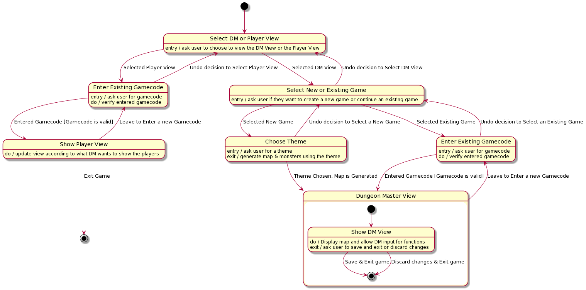
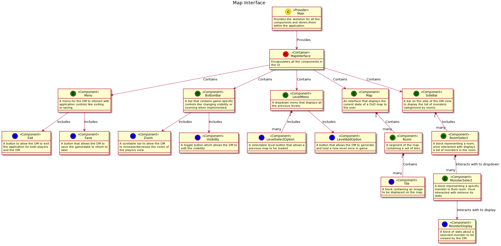
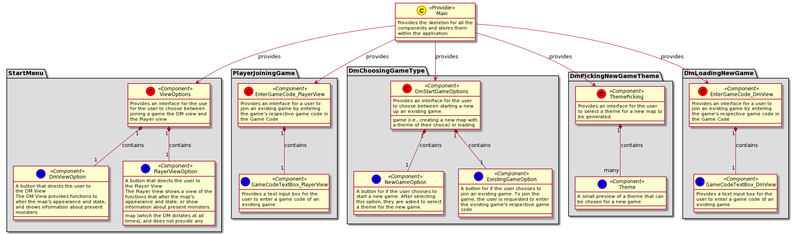

# ENGR 301: Architectural Design and Proof-of-Concept

# ENGR 301 Project "Dungeons and Dragons Tabletop Application 2" Architectural Design and Proof-of-Concept

- Connor de Bruyn, Oliver Badrick, Patrick Laing, Adam Sinclair, Elijah Guarina, Jeremiah Choi, Michael Tang

## 1. Introduction

Dungeons and Dragons (D&D) is a co-operative tabletop fantasy role-playing game. Most players play as adventurers/heroes that explore the world by going on quests, fighting monsters and hunting for rewards. One player is the Dungeon Master (DM) who facilitates the game, controls the non-player characters and monsters, and narrates the story. The players traverse the world as figures moving on top of a set-up map, which contains non-playable characters that the players interact with.

There are enemies that the DM controls (often a type of monster). Each enemy has statistics on its hit points, armour class and speed. This allows the players to interact and do battle with the adversary. The enemies may also contain additional information on their challenge rating, armour type, race, size, alignment and other specific data that could affect the nature of the battle.

D&D includes a specific type of map called dungeons. Which is a dangerous enclosed space (E.g. basement of a haunted mansion, an underground dark elven city, a monster-filled treasure cave) that might contain many dangerous monsters and traps. A dungeon should present a large risk to the players, but they are rewarded heavily if they're triumphant in their dungeon run. A dungeon may contain multiple layers that the players can traverse between. The dungeon should get progressively more dangerous the deeper it is. The players' view is also restricted, meaning they can only see a certain portion of the dungeon and what enemies are within their view at any time (except for the DM, who can see/knows the whole map). This creates uncertainty and allows for interesting decisions/outcomes for the players.

### Client

**Craig Watterson**  
Victoria University of Wellington, Cotton Building, Room 253  
**Phone:** +64 4 886 5333  
**Email:** craig.watterson@vuw.ac.nz  

### 1.1 Purpose

To create a D&D map generator that also generates a well-weighted list of monsters within the map. The generated map can be displayed on a large table screen, and be able be controlled via a secondary screen.

### 1.2 Scope

#### The Map Generation of the Program should meet the Following Goals
 - Maps generated should be different each time
 - Maps should adhere to at least 1 theme
 - The location that enemies are placed should make sense in relation to the place/theme on the map
 - The enemies should be weighted so that the amount of enemies at any given location is well balanced
 - Multiple maps should be able to be generated concurrently on different machines
 - Maps generated should be able to be saved and loaded
 - Users should be able to specify the level/difficulty and theme of the maps, as well as specify it to be random

#### The Primary Map Displaying Screen of the Program should meet the Following Goals
 - The map should be scalable and resizable to the screen that its displayed on
 - Locations on the map should be covered in fog of war unless specified by the dungeon master
 - The map should have some form of scale, allowing players to gauge distance
 - The map displayed should be pannable to adjust for any map size

#### The Secondary Screen Map Controller of the Program should meet the Following Goals
 - The screen should be able to display any/all enemies' stats
 - The dungeon master should be able to see the full map
 - The dungeon master should be able to control where to uncover the fog of war on using the screen
 - The dungeon master should be able to generate a new map with the selected theme
 - The dungeon master should be able to change any monster's stats
 - The dungeon master should be able to pan the map to adjust for any map size

### 1.3 Changes to requirements

The ability to add or remove monsters has been removed. The stakeholder mentioned that he does not need this functionality. 
The minimum viable product has been updated to be more precise:
 - The minimum number of themes is reduced to 1 instead of 3
 - zooming on maps is not required

This reduces our scope of the MVP, and the aforementioned goals have been moved to stretch goals.

## 2. References

[1] Name of Software: ProDnD Publisher: Gray Lake Studios Date Accessed: 23/3/2021 Type of Medium: Mobile App Available: http://prodnd.blogspot.com/

[2] Name of Software: Kahoot! Publisher: Morten Versvik, Johan Brand, and Jamie Brooker Date Accessed: 25/3/2021 Type of Medium Website. Available: https://kahoot.com/

## 3. Architecture

### 3.1 Stakeholders

#### 3.1.1 Identify Stakeholders

For this system the stakeholders are:

| Person/Group | Role(s) |
|-------------------|-------------------|
| Group Members | Developers/Builders |
| Craig Watterson | Client/User/Operator |
| Kris Bubendorfer | Project Manager |
| Calvin Lee | Tutor |
| Craig Anslow | Owner |
| Future Players | User |

#### 3.1.2 Stakeholder Main Concerns

| Person/Group | Role(s) | Main Concern |
|-------------------|-------------------| ------------|
| Group Members | Developers/Builders | The group's main concern is the development of the product. |
| Craig Watterson | Client/User/Operator | Craig's main concern is the end product. |
| Kris Bubendorfer | Project Manager | Kris' main concern is managing interaction between the client and the group members. |
| Calvin Lee | Tutor | Calvin's main concern is the group understanding requirements of the project. |
| Craig Anslow | Owner | Craig's main concern as the owner of the project is the client being statisfied with the final product |
| Future Players | User | This group's main concern is the final product and the playability of the product. |

#### 3.1.3 Other Stakeholder Concerns

##### 3.1.3.1 Group Members

Other concerns of the group members include the quality of the end product and communication between themselves and the client.

##### 3.1.3.2 Craig Watterson

Craig's only concern for this project as the client is the end product's quality.

##### 3.1.3.3 Kris Bubendorfer

Other concerns of Kris include the end product meeting the client's requirements.

##### 3.1.3.4 Calvin Lee

While Calvin's main concern will be that the group understands requirements of the project, he will also be concerned with the wellbeing of the group.

##### 3.1.3.5 Craig Anslow

Craig's only concern is that the final product meets the requirements of the client.

##### 3.1.3.6 Future Players

For the future players of the system, their only concern is playability and quality of the final product.

### 3.2 Architectural Viewpoints

**Logical**

The logical view shows how the system will function for the end user. The diagram in 4.1 shows how the user would use the system.

**Development**

The development view focuses on the development of the software, combining how the system works from the programmers perspective with software management.

**Process**

The process viewpoint describes how the system processes information from the user input to the system output. This viewpoint also goes into detail what the system does for many scenarios that the system may need to work for.

**Physical**

The physical viewpoint describes how the system works with hardware components required to run the system.

**Scenarios**

The scenarios viewpoint focuses on realistic interactions between the user and the system, describing what the system must be capable of in the MVP in relation to the scenario.

### 4. Architectural Views

### 4.1 Logical

#### 4.1.1 State Flow Model:
The State Flow Model below shows what states a user of the web-based DnD Map Generator application may encounter from the point they open the application to the point they close it. The model also shows how the user transitions between these states (as shown by the description of the directed edges between states), including any conditions that must be met before a transition between states can be successfully performed.

#### 4.1.2 Class Interaction Model:
The class interaction model demonstrates the dependencies between providers, containers and components of the web based application, showing the interaction between these classes. Each class is a box and states whether it is a provider (A class that encapsulates multiple containers and runs game functionality), a container (A class that contains components) or a component (A class to represent UI functionality). The arrows represent the dependencies of each class along with a definition into why we have created the dependency.

#### 4.1.2.1 Map Interface Class Model:
The Map interface class model demonstrates the functionality of the DM’s device. Expressing how UI components interact with each other and how information is shared between classes.  In this model, providers are shown in yellow, containers are in red, components are in blue and higher level components that encapsulate other components are in green. 

#### 4.1.2.2 Start Menu Class Model:
The Start Menu Class Model shows the functionality of the choices users can make when opening the web-based DnD map generator application. This includes choosing between the respective views of the DM role and the Player (i.e., the Non-DM) role, and the steps the user follows for each view.
The functionality shown in the model is divided into several classes, and groups of related classes are each encapsulated in a package. There are multiple packages to display, and each package is provided by the “Main” provider class. The provider class is shown in yellow, whereas higher-level components are shown in red, and lower-level components are shown in blue. The model also describes how each class is related to other directly-connected classes, and their multiplicities.

### 4.2 Development

The development view is the system viewed from a programmers perspective, it focuses heavily on software management. This section includes the following four subsections:

- Code Structure
- Version control
- Testing
- Prototyping

#### 4.2.1 Code Structure

The code structure subsection covers the software architecture. The following diagrams represents the modules that make up the software, and the interactions between them.

#### 4.2.2 Version control

We will be using Gitlab for version control on this project. By using Gitlab, we can store the files needed for the project online, so the files are backed up online and available to everyone in the team.

In Gitlab we will be using branches to work on the different parts of the project. A branch will be made for each issue in the project. Branches are a feature that allows different members of the team to make a separate branch from the master, and store their code. This allows everyone to work on their own branch on their own device. It also ensures that buggy or unfinished code is not pushed to the master branch. When the branch has been completed, it can be merged with the master branch, and any conflicts that arise can be handled when the team next meets up.

We will also use Issues and Epics to divide the tasks and assign them to each team member. This allows us to know exactly what needs to be done, what is being worked on and what is completed. It also lets us know who worked on what aspect of the program. 

#### 4.2.3 Testing

The testing section covers the methods we will use to ensure software functionality during development. 
We will utilize two methods, each explained in a subsection of its own:
- Automated testing
- Play testing

##### 4.2.3.1 Automated testing

We will use Javascript Unit Testing to test the functionality of the program. Since this project includes data being sent between different devices, saved, and loaded, we will need to ensure that the data being sent is the same as the data received. Using Unit Testing will be the most efficient way to test this. We can write functions to test specific functionalities of the program. For testing the functionality, this is a more efficient method of testing than just running the program and getting an idea of whether it works or not. It allows us to test a wide variety of different conditions, and if something isn’t working it will be easier to narrow down what’s wrong.

##### 4.2.3.2 Play testing

Whilst backend software is tested via automated testing (refer to section 4.2.3.1), the user interface and interaction the software provides must be tested manually.
There are three things we must test during development:
- The first thing we'll test is the visual functionality of the user interface features. (for instance: Making a popup window).
- The second thing we'll test is the gameplay. The software is designed to aid the DM and his friends when they play DnD. We can test this ourselves by playing a game of dnd using the system after a number of sprints. 
- The third thing is user friendliness. To test the user friendliness, we require a DM with no prior knowledge of the software to test the system. We can acquire DM testers, outside the development team, via personal connections. However these tests cannot be conducted often as it is unknown how willing they'll be to volunteer.

#### 4.2.4 Prototyping

The prototyping section covers the usage of prototypes during development.

During development, it is important to inform the client of the completed features and the features still in progress. Developing small scaled early iteration will allow us to showcase the client our understanding of his specifications. The client, in return, can either confirm or clarify on his specification. Furthermore, prototypes of functional features updates our client on our development progress and allow for playtesting of the software (refer to sub-section 4.2.3.2).

### 4.3 Process

The process view shows what happens when the user is interacting with the system and the underlying interactions between different classes of the system with a focus on the run time behaviour. The arrows show class interactions with a description for each interaction to help with understanding of what is happening. Our process view is broken down into the start/loading of a game, and a game in progress.

#### Start/Load Game

#### Game In Progress

### 4.4 Physical 

Our system is mostly a software system, meaning there would be very little hardware required. However there will still be some physical architecture involved, such as the computers we code with, the Dungeon Master's device, and the TV, projector, touch screen table, tablet, or anything that can display our system as a full sized map while being able to give the users the ability to display their characters on the screen using figurines the players have in person.

This system will need to be able to connect to two pieces of hardware per game, the Dungeon Master's device, a phone, tablet, or computer, and the player's device, be it a TV, projector or anything similar, and send to the hardware the images to display. The system will need to send to the player's device images based on what the Dungeon Master wants to display, which will be controlled via the Dungeon Master's device.

This would involve setting up a connection between the two pieces of hardware via connection to a server, once the devices are connected to each other, the server will need to send data to the Dungeon Master's device to create the map, and then send to the player's device the map information as the Dungeon Master wants the map to be displayed. As the game continues on, the Dungeon Master's device will send more information to the player's device based on what the Dungeon Master wants the player to see.

The connection between server and hardware will need to also work for saving and loading the map information when the Dungeon Master wants to save a current game, or load an existing game.

Overall the system is not entirely dependant on the hardware components, but is more dependant on software components. The dependancy on hardware components is based on whether the hardware works and is able to do what is needed, for example the Dungeon Master's device must be able to connect to the internet, must be able to input and change data, and must have a display. The player's device must be able to connect to the internet, receive data, and display information. Any further features of these devices would not be necessary but would not hinder the performance of the system.

### 4.5 Scenarios

We have determined our two most important scenarios for our MVP are:

- The user is able to view a randomly generated Dungeons and Dragons dungeon map, which is able to be traversed from the start to the end.
  - The map generation will need to be different each time, with no two dungeons the same.

- The map must be populated with monsters according to the level of the Dungeon.
  - The monsters would be grouped by room, and not be necessary for the DM to use, they will only be a guide for the DM if needed.

## 5. Development Schedule

### 5.1 Schedule

#### Architectural prototype
14/05/2021
- The architectural prototype is to be completed by Friday 14th May 2021

#### Map Generation Demo
01/06/2021
- The map generation will be demoed to get client feedback

#### Monster Generation Demo
26/07/2021
- Monsters incorporated into map generation to be demoed for client feedback

#### Saving and Loading
09/08/2021
- Saving and loading functionality to be demoed for client feedback

#### Minimum viable product
07/09/2021
- Minimum viable product to be demoed for client feedback.

### 5.2 Budget

No paid items to be purchased have been outlined to be required for the purpose of constructing the system. Because no purchases have been outlined, and therefore no expenses have been outlined, no budget has been explicitly allocated for this project.

However, a few potential expenses have been outlined. Potential expenses are expenses that are not determined to be necessary for the completion of this project, and therefore their costs and budgets are initially not real expenses. However, these potential expenses are considered to become real expenses if certain project circumstances change. If any of these potential expenses are ever decided to be purchased for the purpose of this project (i.e., they become real expenses), then their corresponding budgets are to be used to limit spending on each respective expense.

The table below describes these potential expenses.  
| Item            | Purpose                              | Budget (NZD)       |
|---------------------------|--------------------------------------------------------------------|-------------------|
| Cloud Instance | A Cloud Instance is to be paid for if the DnD Map Generator application is to be hosted and launched from the instance on a Cloud service such as Microsoft Azure or Amazon Web Service. This however is an alternative option, as ideally, the application would be hosted instead on servers operated by Victoria University of Wellington: School of Engineering and Computer Science (a.k.a. ECS Servers). This is because hosting the application from the ECS Servers would be free, whereas hosting it on Cloud services would not. If this ideal option turns out to not be possible however, then a Cloud instance would be the next preferred choice, and the outlined budget would be the limit on how much is spent on using the Cloud instance.  | $50.00 |
| Paid Assets | Paid Assets are third-party non-free resources to be used in the DnD Map Generator. This includes map textures, User Interface artwork, or any other assets to be outlined in the future. There is no initial plan to purchase any paid assets, as there is a bias to using free assets.  | $100.00 |

### 5.3 Risks

| # | Risk | Risk Type | Likelihood | Severity |
| --- | :--------------------------------------------------------------------------------: |  --------------- | ------------ | ---------------- |
| 1 | COVID-19 levels increase, restricting access to laboratories and equipment | Performance | High | Tolerable |
| 2 | Client removes budget or online resources become unavailable | Financial / Availability | Low | Tolerable |
| 3 | Incompatibility of services or equipment | Availability / Performance | Medium | Severe |
| 4 | Minimal requirements will not be met by the end of the project (Scope creep) | Operational | Medium | Extreme |
| 5 | Team members are unable to work on the project (Illness, lack of internet, etc) | Health and Safety / Performance | Medium | Extreme |
| 6 | Customer alters the requirements during development | Strategic | Low | Tolerable |
| 7 | The products do not align with stakeholder expectations | Strategic | Medium | Tolerable |
| 8 | Lack of communication amongst team members and stakeholders | Performance | Low | Severe |
| 9 | Product has underlying bugs that impact the products functionality | Operational | Low | Tolerable |
| 10 | Team members lack required skills to complete the project | Performance | Low | Tolerable |

| # | Risk | Mitigation Strategy |
| --- | :--------------------------------------------------------------------------------: |  ------------------------------------------------ |
| 1 | COVID-19 levels increase, restricting access to laboratories and equipment | Frequent usage of online resources to keep in-contact and productive until covid levels decrease or the project finalizes.  |
| 2 | Client removes budget or online resources become unavailable | Utilisation of offline resources, if we are using any online assets (or planning to) we will need to produce them ourselves.  |
| 3 | Incompatibility of services or equipment | Research alternative services and equipment to use in case the current ones fail or become unavailable for usage. |
| 4 | Minimal requirements will not be met by the end of the project (Scope creep) | We could invest in buying components to fulfil the remaining requirements or focus all members efforts into accomplishing the minimum requirements before attempting stretch goals. |
| 5 | Team members are unable to work on the project (Illness, lack of internet, etc) | Divide the absent members workload evenly amongst all remaining members to keep workflow consistent and to not overwhelm one member. |
| 6 | Customer alters the requirements during development | As the client did not specify these requirements during the proposition, we may decline the additional requirements if we deem them to be unachievable during the remaining time given.  |
| 7 | The products do not align with stakeholder expectations | Create frequent meetings with the client to ensure that each feature added is to specification. This will provide clarity if we are missing features or misinterpreted requirements. |
| 8 | Lack of communication amongst team members and stakeholders | We will conduct frequent weekly meetups and utilize online social media platforms (Mattermost) to ensure each member understands the given situation and tasks needed to be completed for project completion.  |
| 9 | Product has underlying bugs that impact the products functionality | We can create tests to identify and fix bugs occurring during development of each function. Ensuring each function remains bug-free before advancing to new tasks. |
| 10 | Team members lack required skills to complete the project | Create sessions to learn the required information needed to progress through the project. If one member knows the skills necessary, they can tutor the remaining members until all members are fully capable to continue. |

### 5.4 Health and Safety

1. These are the computer-related risks that could occur during this project, and how they will be managed.
- Eye damage: The 20-20-20 rule. Every 20 minutes, look at somthing 20 feet away for 20 seconds
- Spine injury: Make sure to stretch for about 5-10 minutes every hour
- Hand injury: Make sure to remove hands from keyboard when its not being used, also use whole arm to move mouse instead of wrist

2. The project does not requre work or testing at an external workplace/site.

3. The project does not require any testing with human and animal subjects.

#### 5.4.1 Safety Plans

Project requirements do not involve risk of death, serious harm, harm or injury.

## 6. Appendices

### 6.1 Assumptions and dependencies

- That the devices used have access to the internet
- That the devices used have enough computing power to run the application
- That the online server used to store the saved game has enough space to store the file
- That the device that displays the map has a large enough display for the player's physical figures to fit on the map 
- That the device that the DM uses has some way to get input

### 6.2 Acronyms and abbreviations

**Contextual Acronyms and Abbreviations:**
* DnD/D&D: The fantasy tabletop role-playing game Dungeons and Dragons published by Wizards of the Coast.
* DM: The "Dungeon Master" that dictates the world of a DnD game (a.k.a. GM or "Game Master"). They are the one in control of a DnD game, and so in this web-based DnD map generator application, are also the one able to alter and switch between levels and maps.

**Risk Acronyms and Abbreviations:**
* Performance Risk: A risk that impacts the efficiency of project operations.
* Financial Risk: A risk that impacts the budget of the product, affecting bought items and assets.
* Availability Risk: A risk that halts or reduces the amount of work team-members can contribute.
* Operational Risk: A risk that alters the functionality of the product.
* Health and Safety Risk: A risk that impacts the health and well-being of the team members.
* Strategic Risk: A risk that alters requirements of the project or client specifications. 

## 7. Contributions

| Member | Contributions |
|------|------|
| Adam Sinclair | 4.3, 7 |
| Connor de Bruyn | 4.1, 4.1.1, 4.1.2, 4.1.2.1, 5.3, 6.2, 7 |
| Elijah Guarina | 4.1, 4.1.1, 4.1.2.1, 4.1.2.2, 6.2, 7 |
| Jeremiah Choi | 4.2, 4.2.3, 4.2.3.2, 4.2.4, 7 |
| Michael Tang | 1, 4.3, 7 |
| Oliver Badrick | 4.2.1, 4.2.2, 4.2.3.1, 7 |
| Patrick Laing | 2, 3.1, 3.2, 4.4, 4.5, 5.1, 7 |

---

## Formatting Rules 

 * Write your document using [Markdown](https://gitlab.ecs.vuw.ac.nz/help/user/markdown#gitlab-flavored-markdown-gfm) in your team's GitLab repository.
 * Major sections should be separated by a horizontal rule.

## Assessment 

This document will be weighted at 20% on the architectural proof-of-concept(s), and 80% on the architecture design.

The proof-of-concept will be assessed for coverage (does it demonstrate all the technologies needed to build your project?) and quality (with an emphasis on simplicity, modularity, and modifiability).

The document will be assessed by considering both presentation and content. Group and individual group members will be assessed by identical criteria, the group mark for the finished PDF and the individual mark on the contributions visible through `git blame`, `git diff`, file histories, etc. 

The presentation will be based on how easy it is to read, correct spelling, grammar, punctuation, clear diagrams, and so on.

The content will be assessed according to its clarity, consistency, relevance, critical engagement and a demonstrated understanding of the material in the course. We look for evidence these traits are represented and assess the level of performance against these traits. Inspection of the GitLab Group is the essential form of assessing this document. While being comprehensive and easy to understand, this document must be reasonably concise too. You will be affected negatively by writing a report with too many pages (far more than what has been suggested for each section above).

---
