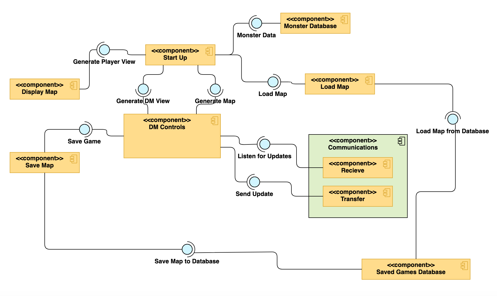

# ENGR 301: Architectural Design and Proof-of-Concept

## Proof-of-Concept

The aim of an architectural proof-of-concept (spike or walking skeleton) is to demonstrate the technical feasibility of your chosen architecture, to mitigate technical and project risks, and to plan and validate your technical and team processes (e.g., build systems, story breakdown, Kanban boards, acceptance testing, deployment).

A walking skeleton is an initial technical attempt that will form the architectural foundation of your product. Since a walking skeleton is expected to be carried into your product, it must be completed to the quality standards expected for your final product. A walking skeleton should demonstrate all the technologies your program will rely on "end-to-end" &mdash; from the user interface down to the hardware.

In the context of ENGR 301, a walking skeleton does not need to deliver any business value to your project: the aim is technical validation and risk mitigation.

## Document

The aim of the architectural design document is to describe the architecture and high-level design of the system your group is to build, to identify any critical technical issues with your design, and to explain how you have addressed the highest rated technical and architectural risks. The architecture document should also demonstrate your understanding of architectural techniques and architectural quality, using tools and associated notations as necessary to communicate the architecture precisely, unambiguously and clearly in a written technical document.

Page specifications below are *limits not targets* and refer to the pages in the PDF generated from the markdown. Because the size of your document is necessarily limited, you should ensure that you focus your efforts on those architectural concerns that are most important to completing a successful system: if sections are at their page limit, indicate how many items would be expected in a complete specification.

The ENGR 301 project architecture design document should be based on the standard ISO/IEC/IEEE 42010:2011(E) _Systems and software engineering &mdash; Architecture description_, plus appropriate sections from ISO/IEC/IEEE 29148:2018(E) _Systems and software engineering &mdash; Life cycle processes &mdash; Requirements engineering_; ISO/IEC/IEEE 15289:2017 _Systems and software engineering &mdash; Content of life-cycle information items (documentation)_; ISO/IEC/IEEE 15288:2015 _Systems and software engineering &mdash; System life-cycle processes_; ISO/IEC/IEEE 12207:2017 _Systems and software engineering &mdash; Software life cycle processes_ and ISO 25010 SQuaRE; with notations from ISO/ISE 19501 (UML). In particular, Annex F of ISO/IEC/IEEE 15288 and Annex F of ISO/IEC/IEEE 12207. These standards are available through the Victoria University Library subscription to the [IEEE Xplore Digital Library](https://ieeexplore.ieee.org/) (e.g., by visiting IEEE Xplore from a computer connected to the University network).

The document should contain the sections listed below, and conform to the formatting rules listed at the end of this brief.

All team members are expected to contribute equally to the document and list their contributions in the last section of the document (please make sure that your continued contribution to this document can be traced in GitLab). You should work on your document in your team's GitLab repository in a directory called "M2_Architecture". If more than one team member has contributed to a particular commit, all those team member IDs should be included in the first line of the git commit message. ``git blame``, ``git diff``, file histories, etc. will be tools used to assess individual contributions, so everyone is encouraged to contribute individually (your contribution should be made to many sections of the document, rather than focusing on just a single section), commit early and commit often.

---

# ENGR 301 Project *NN* Architectural Design and Proof-of-Concept

**Authors:** a comma-separated list of the names of each member of the team.

## 1. Introduction

Dungeons and Dragons (D&D) is a co-operative tabletop fantasy role-playing game. Most players play as adventurers/heroes that explore the world by going on quests, fighting monsters and hunting for rewards. One player is the Dungeon Master (DM) who facilitates the game, controls the non-player characters and monsters, and narrates the story. The players traverse the world as figures moving on top of a set-up map, which contains non-playable characters that the players interact with.

There are enemies that the DM controls (often a type of monster). Each enemy has statistics on its hit points, armour class and speed. This allows the players to interact and do battle with the adversary. The enemies may also contain additional information on their challenge rating, armour type, race, size, alignment and other specific data that could affect the nature of the battle.

D&D includes a specific type of map called dungeons. Which is a dangerous enclosed space (E.g. basement of a haunted mansion, an underground dark elven city, a monster-filled treasure cave) that might contain many dangerous monsters and traps. A dungeon should present a large risk to the players, but they are rewarded heavily if they're triumphant in their dungeon run. A dungeon may contain multiple layers that the players can traverse between. The dungeon should get progressively more dangerous the deeper it is. The players' view is also restricted, meaning they can only see a certain portion of the dungeon and what enemies are within their view at any time (except for the DM, who can see/knows the whole map). This creates uncertainty and allows for interesting decisions/outcomes for the players.

### Client

**Craig Watterson**  
Victoria University of Wellington, Cotton Building, Room 253  
**Phone:** +64 4 886 5333  
**Email:** craig.watterson@vuw.ac.nz  

### 1.1 Purpose

To create a D&D map generator that also generates a well-weighted list of monsters within the map. The generated map can be displayed on a large table screen, and be able be controlled via a secondary screen.

### 1.2 Scope

#### The Map Generation of the Program should meet the Following Goals
 - Maps generated should be different each time
 - Maps should adhere to at least 1 theme
 - The location that enemies are placed should make sense in relation to the place/theme on the map
 - The enemies should be weighted so that the amount of enemies at any given location is well balanced
 - Multiple maps should be able to be generated concurrently on different machines
 - Maps generated should be able to be saved and loaded
 - Users should be able to specify the level/difficulty and theme of the maps, as well as specify it to be random

#### The Primary Map Displaying Screen of the Program should meet the Following Goals
 - The map should be scalable and resizable to the screen that its displayed on
 - Locations on the map should be covered in fog of war unless specified by the dungeon master
 - The map should have some form of scale, allowing players to gauge distance
 - The map displayed should be pannable to adjust for any map size

#### The Secondary Screen Map Controller of the Program should meet the Following Goals
 - The screen should be able to display any/all enemies' stats
 - The dungeon master should be able to see the full map
 - The dungeon master should be able to control where to uncover the fog of war on using the screen
 - The dungeon master should be able to generate a new map with the selected theme
 - The dungeon master should be able to change any monster's stats
 - The dungeon master should be able to pan the map to adjust for any map size

### 1.3 Changes to requirements

If the requirement have changed significantly since the requirements document, outline the changes here. Changes must be justified and supported by evidences, i.e., they must be substantiated. (max one page, only if required)

## 2. References

References to other documents or standards. Follow the IEEE Citation Reference scheme, available from the [IEEE website](https://ieee-dataport.org/sites/default/files/analysis/27/IEEE%20Citation%20Guidelines.pdf) (PDF; 20 KB). (1 page, longer if required)

## 3. Architecture

Describe your system's architecture according to ISO/IEC/IEEE 42010:2011(E), ISO/IEC/IEEE 12207, ISO/IEC/IEEE 15289 and ISO/IEC/IEEE 15288.

Note in particular the note to clause 5 of 42010:

_"The verb include when used in Clause 5 indicates that either the information is present in the architecture description or reference to that information is provided therein."_

This means that you should refer to information (e.g. risks, requirements, models) in this or other documents rather than repeat information.

### 3.1 Stakeholders

See ISO/IEC/IEEE 42010 clause 5.3 and ISO/IEC/IEEE 12207 clause 6.4.4.3(2).

For most systems this will be about 2 pages, including a table mapping concerns to stakeholder.

### 3.2 Architectural Viewpoints
(1 page, 42010 5.4) 

Identify the architectural viewpoints you will use to present your system's architecture. Write one sentence to outline each viewpoint. Show which viewpoint frames which architectural concern.

### 4. Architectural Views

(5 sub-sections of 2 pages each sub-section, per 42010, 5.5, 5.6, with reference to Annex F of both 12207 and 15288) 

Describe your system's architecture in a series of architectural views, each view corresponding to one viewpoint.

You should include views from the following viewpoints (from Kruchten's 4+1 model):

 * Logical
 * Development
 * Process
 * Physical 
 * Scenarios - present scenarios illustrating how two of your most important use cases are supported by your architecture

As appropriate you should include the following viewpoints:

 * Circuit Architecture
 * Hardware Architecture

Each architectural view should include at least one architectural model. If architectural models are shared across views, refer back to the first occurrence of that model in your document, rather than including a separate section for the architectural models.

### 4.1 Logical
...

### 4.2 Development

The development view is the system viewed from a programmers perspective, it focuses heavily on software management. This section includes the following four subsections:

- Code Structure
- Version control
- Testing
- Prototyping

#### 4.2.1 Code Structure

The code structure subsection covers the software architecture. The following diagrams represents the modules that make up the software, and the interactions between them.

#### 4.2.2 Version control

We will be using Gitlab for version control on this project. By using Gitlab, we can store the files needed for the project online, so the files are backed up online and available to everyone in the team.

In Gitlab we will be using branches to work on the different parts of the project. A branch will be made for each issue in the project. Branches are a feature that allows different members of the team to make a separate branch from the master, and store their code. This allows everyone to work on their own branch on their own device. It also ensures that buggy or unfinished code is not pushed to the master branch. When the branch has been completed, it can be merged with the master branch, and any conflicts that arise can be handled when the team next meets up.

We will also use Issues and Epics to divide the tasks and assign them to each team member. This allows us to know exactly what needs to be done, what is being worked on and what is completed. It also lets us know who worked on what aspect of the program. 

#### 4.2.3 Testing

The testing section covers the methods we will use to ensure software functionality during development. 
We will utilize two methods, each explained in a subsection of its own:
- Automated testing
- Play testing

##### 4.2.3.1 Automated testing

We will use Javascript Unit Testing to test the functionality of the program. Since this project includes data being sent between different devices, saved, and loaded, we will need to ensure that the data being sent is the same as the data received. Using Unit Testing will be the most efficient way to test this. We can write functions to test specific functionalities of the program. For testing the functionality, this is a more efficient method of testing than just running the program and getting an idea of whether it works or not. It allows us to test a wide variety of different conditions, and if something isn’t working it will be easier to narrow down what’s wrong.

##### 4.2.3.2 Play testing

Whilst backend software is tested via automated testing (refer to section 4.2.3.1), the user interface and interaction the software provides must be tested manually.
There are three things we must test during development:
- The first thing we'll test is the visual functionality of the user interface features. (for instance: Making a popup window).
- The second thing we'll test is the gameplay. The software is designed to aid the DM and his friends when they play DnD. We can test this ourselves by playing a game of dnd using the system after a number of sprints. 
- The third thing is user friendliness. To test the user friendliness, we require a DM with no prior knowledge of the software to test the system. We can acquire DM testers, outside the development team, via personal connections. However these tests cannot be conducted often as it is unknown how willing they'll be to volunteer.

#### 4.2.4 Prototyping

The prototyping section covers the usage of prototypes during development.

During development, it is important to inform the client of the completed features and the features still in progress. Developing small scaled early iteration will allow us to showcase the client our understanding of his specifications. The client, in return, can either confirm or clarify on his specification. Furthermore, prototypes of functional features updates our client on our development progress and allow for playtesting of the software (refer to sub-section 4.2.3.2).

### 4.3 Process
...

### 4.4 Physical 
...

### 4.5 Scenarios
...

## 5. Development Schedule

_For each subsection, make clear what (if anything) has changed from the requirements document._ If unchanged, these sections should be copied over from the requirements document, not simply cross-referenced.

Schedules must be justified and supported by evidences; they must be either direct client requirements or direct consequences of client requirements. If the requirements document did not contain justifications or supporting evidences, then both must be provided here.

### 5.1 Schedule

Identify dates for key project deliverables:

1. prototype(s).
1. first deployment to the client.
1. further improvements required or specified by the client.

(1 page).

### 5.2 Budget and Procurement

#### 5.2.1 Budget

Present a budget for the project (as a table), showing the amount of expenditure the project requires and the date(s) on which it will be incurred. Substantiate each budget item by reference to fulfilment of project goals (one paragraph per item).

(1 page). 

#### 5.2.2 Procurement

Present a table of goods or services that will be required to deliver project goals and specify how they are to be procured (e.g. from the School or from an external organisation). These may be software applications, libraries, training or other infrastructure, including open source software. Justify and substantiate procurement with reference to fulfilment of project goals, one paragraph per item.
(1 page).

### 5.3 Risks 

Identify the ten most important project risks: their type, likelihood, impact, and mitigation strategies (3 pages).

### 5.4 Health and Safety

Document here project requirements for Health and Safety.

#### 5.4.1 Safety Plans

Safety Plans may be required for some projects, depending on project requirements.

## 6. Appendices

### 6.1 Assumptions and dependencies 

One page on assumptions and dependencies (9.5.7) 

### 6.2 Acronyms and abbreviations

One page glossary as required 

## 7. Contributions

An one page statement of contributions, including a list of each member of the group and what they contributed to this document.

---

## Formatting Rules 

 * Write your document using [Markdown](https://gitlab.ecs.vuw.ac.nz/help/user/markdown#gitlab-flavored-markdown-gfm) in your team's GitLab repository.
 * Major sections should be separated by a horizontal rule.

## Assessment 

This document will be weighted at 20% on the architectural proof-of-concept(s), and 80% on the architecture design.

The proof-of-concept will be assessed for coverage (does it demonstrate all the technologies needed to build your project?) and quality (with an emphasis on simplicity, modularity, and modifiability).

The document will be assessed by considering both presentation and content. Group and individual group members will be assessed by identical criteria, the group mark for the finished PDF and the individual mark on the contributions visible through `git blame`, `git diff`, file histories, etc. 

The presentation will be based on how easy it is to read, correct spelling, grammar, punctuation, clear diagrams, and so on.

The content will be assessed according to its clarity, consistency, relevance, critical engagement and a demonstrated understanding of the material in the course. We look for evidence these traits are represented and assess the level of performance against these traits. Inspection of the GitLab Group is the essential form of assessing this document. While being comprehensive and easy to understand, this document must be reasonably concise too. You will be affected negatively by writing a report with too many pages (far more than what has been suggested for each section above).

---
